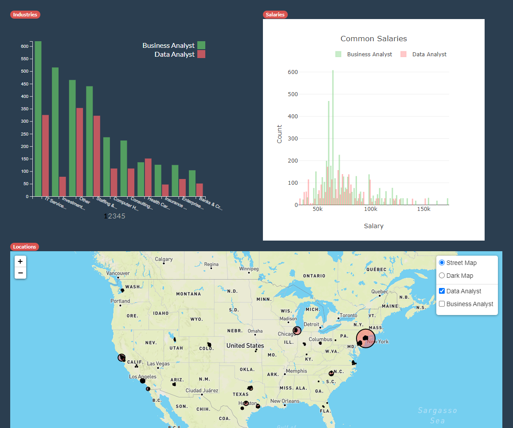

# Jobs in Data
Blake Ashford, Lucy Kaplan, Savannah Cordry

Since we will soon complete the University of Oregon Data & Analytics Bootcamp, we would like to investigate options for employment across the country. 

### The Primary Question
As a data scientist, what factors need to be considered when job searching? 
  1. Location: Where are the most jobs available?
  2. Salary: What jobs pay the most?
  3. What industries have the most available data science jobs?
  4. Title: How are these variables affected by job title (Data Analyst vs. Business Analyst)?

## The Method
We will take data provided by Kaggle in CSV format, clean it, and then import it into a Mongo database. From there, we'll be able to put the data onto a website for users to easily access the data through maps and graphs.

## The Instructions
##### *You will need a working MongoDB installation and a Google Geocode API Key for this to run.*

### Step 1: Import the data to MongoDB
We have provided clean CSV files in the data folder, so there's no need to clean the data, just to import it. Create a file named `config.py` in the [data folder](https://github.com/luciennekaplan/Project-2/tree/main/data) and store your API key as a string in a variable called `API_KEY`. Then run [mongoImport.py](https://github.com/luciennekaplan/Project-2/blob/main/data/mongoImport.py). **Note:** this will take a couple minutes while it gathers the coordinates from Google.
### Step 2: Start up the webpage
Head to the `app.py` file in the main folder and run it - this should start up a local server for you to view the webpage at. Navigate to the webaddress it gives you and voila! There you have it.

### Website Functionality
When the website loads it will look like this: 

You can click on the bars in the industry chart to update the salary chart to just have the salaries for that industry:

You can also click on a specific city to get the industries and salaries for that city:

From there you can click on the industry bar that you want again to see the salaries for industy in that particular city:

